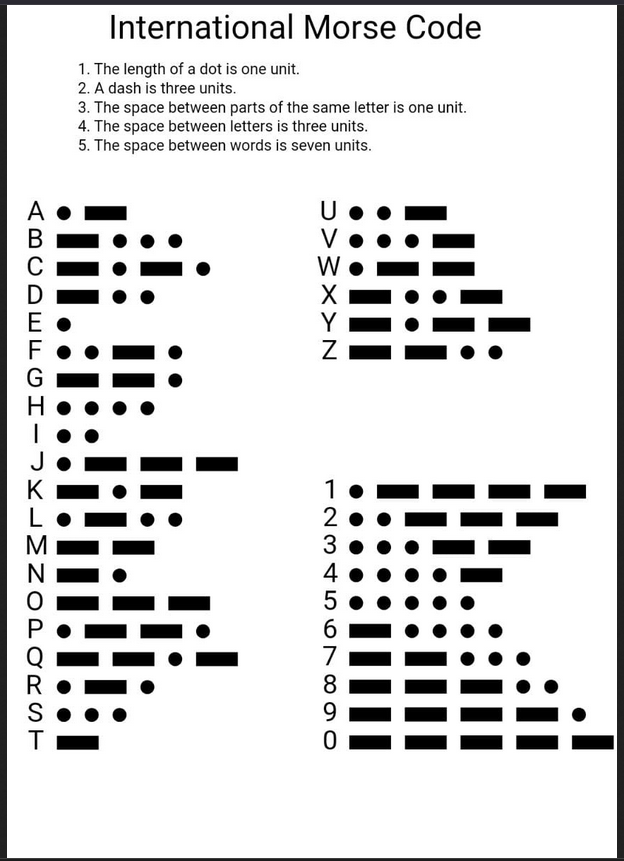
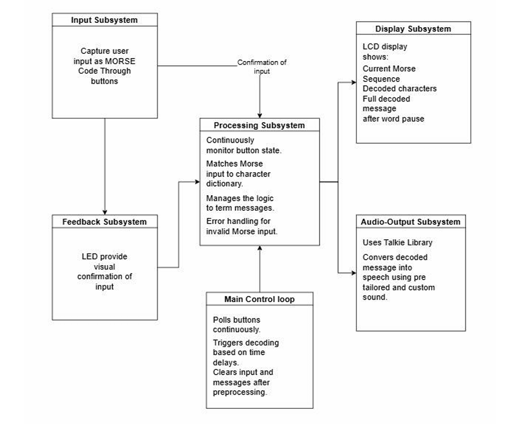
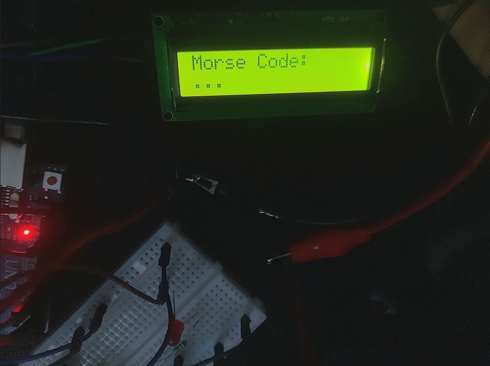
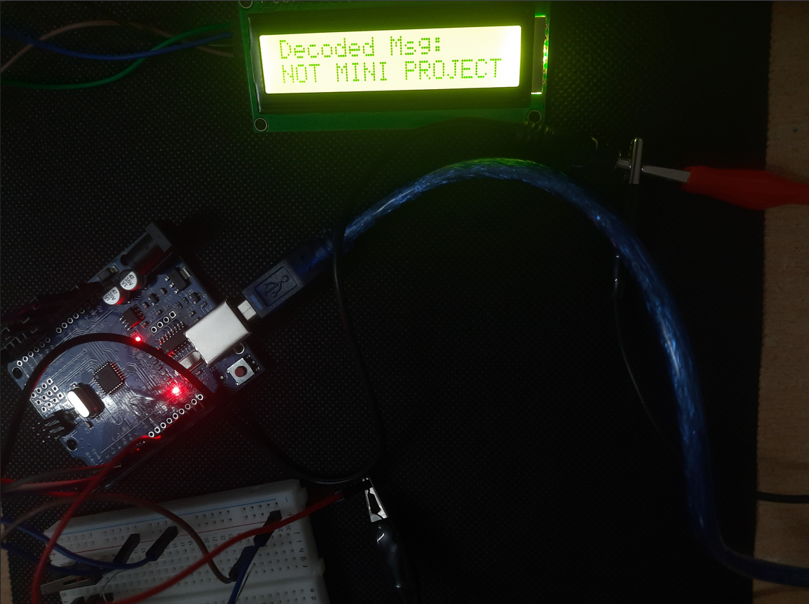
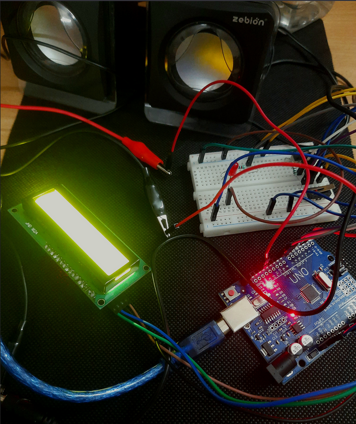

# Whispers in Morse

> Encrypting and Decrypting Messages using Arduino


---

## Overview

This project implements a **Morse Code Translator System** using an Arduino microcontroller that enables communication using **dot (.) and dash (-) signals**.

The system:

* Accepts Morse input via **push buttons**
* Converts it into **text**
* Displays output on an **I2C LCD**
* Provides **audio feedback using a speaker**

It is specifically designed as an **assistive communication tool for speech-impaired individuals** and for **emergency communication scenarios**.

---

## Key Idea

> Minimal input → Intelligent decoding → Multi-modal output (Text + Audio)

---

## Project Preview

### International Morse codes

<p align="center">
  
</p>

### System Architecture

<p align="center">
  
</p>

### Encoding Output

<p align="center">
  
</p>

### Decoding Output

<p align="center">
  
</p>

### Setup / Hardware

<p align="center">
  
</p>

---

## Project Structure

```
morse-code-translator/
│
├── imgs/                      # Project images
│   ├── Int.png
│   ├── ad.png
│   ├── enc.png
│   ├── dec.png
│   └── setup.png
│
├── button_to_morse.ino       # Handles button input → Morse signals
├── ledchar.ino               # LED + character output logic
├── Morse_code                # Old version
├── Final_code                # Morse mapping / logic file and Final integrated system code
│
└── README.md
```

---

## 🧠 Code Explanation

### 1. `button_to_morse.ino`

* Reads push button inputs
* Detects:

  * Short press → dot (.)
  * Long press → dash (-)
* Sends Morse sequence

---

### 2. `ledchar.ino`

* Converts decoded Morse → character
* Controls LED / output feedback
* Displays characters

---

### 3. `Final_code`

* Contains Morse dictionary
* Maps:

  ```
  .- → A
  -... → B
  ```
* Used for decoding logic

* Integrates all modules:

  * Input handling
  * Decoding
  * LCD display
  * Audio output
* This is the **main runnable file**

---

## Important Note

Only **upload and run `Final_code` in Arduino IDE**
Other `.ino` files act as modular components / references.

---

## Features

*  Real-time Morse code decoding
*  Dual input system (Dot / Dash buttons)
*  LCD text output
*  Audio feedback for each input
*  Custom Morse code system (unique patterns + shortcut words)
*  Assistive communication support

---

## Methodology

### 1. Input System

* Two push buttons:

  * Dot (.)
  * Dash (-)
* Debouncing applied for accurate input detection

---

### 2. Signal Processing

* Inputs stored as sequences of dots and dashes
* Timing used to detect:

  * Character end → 1.5 sec pause
  * Word end → 3 sec pause

---

### 3. Decoding Logic

* Morse sequence matched using **predefined lookup table**
* Supports:

  * Alphabets (A–Z)
  * Numbers (0–9)
  * Custom shortcut words (YES, NO, HELP)

---

### 4. Output Handling

* LCD displays decoded text
* Speaker provides audio cues
* Optional speech using Talkie library

---

### 5. Error Handling

* Invalid sequences → replaced with `?`
* Errors logged via Serial Monitor

---

## System Workflow

```id="flow123"
Button Input
   ↓
Signal Detection
   ↓
Morse Sequence Formation
   ↓
Lookup Table Matching
   ↓
Decoded Character
   ↓
LCD Display + Audio Output
```

---

## Hardware Requirements

* Arduino UNO
* I2C LCD (16x2)
* Push Buttons (x2)
* Speaker / Buzzer
* Breadboard
* Resistors
* Jumper Wires

---

## Software Requirements

* Arduino IDE
* Libraries:

  * LiquidCrystal_I2C
  * Wire
  * Talkie

---

## Pin Configuration

| Component   | Pin |
| ----------- | --- |
| Dot Button  | D2  |
| Dash Button | D3  |
| Speaker     | D4  |
| LCD SDA     | A4  |
| LCD SCL     | A5  |

---

## Setup Instructions

### 1. Clone Repository

```bash id="clone123"
git clone https://github.com/YOUR_USERNAME/morse-code-translator.git
cd morse-code-translator
```

---

### 2. Install Dependencies

* Install Arduino IDE
* Add required libraries

---

### 3. Upload Code

* Open `main.ino`
* Select Arduino UNO
* Upload

---

## Usage

| Action            | Result           |
| ----------------- | ---------------- |
| Press Dot Button  | Adds "."         |
| Press Dash Button | Adds "-"         |
| Pause 1.5 sec     | Decode character |
| Pause 3 sec       | Add space        |

---

## Example

Input:

```id="ex123"
... --- ...
```

Output:

```id="ex456"
SOS
```

---

## Applications

* Assistive communication for speech-impaired individuals
* Emergency communication in remote areas
* Silent communication environments
* Secure encoded messaging

---

## Advantages

* Simple and easy to use
* Cost-effective system
* Works without internet
* Reliable in emergency conditions

---

## Limitations

* Requires learning Morse code
* Slower input speed
* No intelligent error correction

---

## Future Scope

* Wearable Morse input device
* Multilingual output system
* AI-based prediction and correction
* Mobile app integration

---

## Description

> *Developed an Arduino-based Morse code translator that converts dot-dash inputs into real-time text and audio output, enabling assistive and emergency communication.*

---

## Authors

* Kishor Jawale
* Sakshi Jadhav
* Chaitrali Deshpande
* Siddhi Gadekar
  
---

## License

MIT License

---

## Copyright

© 2025 Whispers in Morse Project Team. All rights reserved.  
The project titled *"Whispers in Morse: Encrypting and Decrypting Messages"* has been successfully copyrighted.
